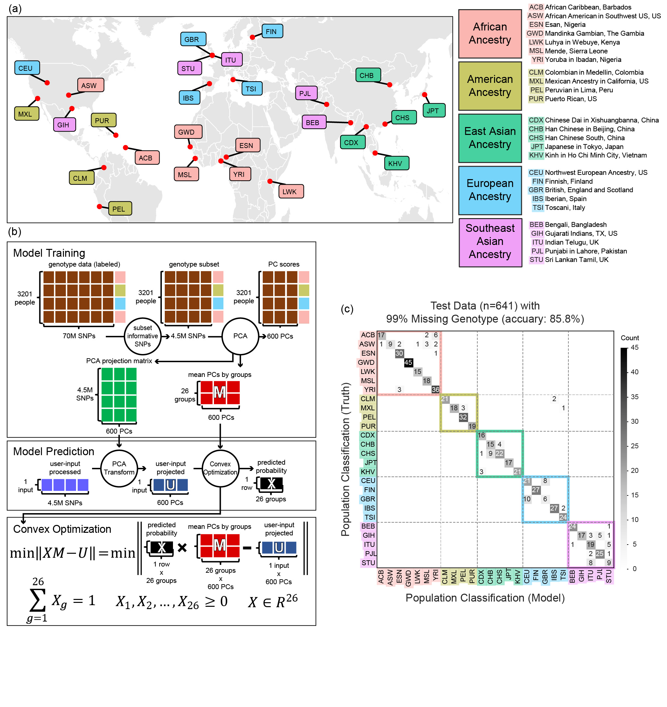

# ancestry-informative SNP (scAI-SNP)



## Prerequisites 
- pip
- python 3.7+

## Installation

Because this repository includes large files (over 100MB), we excluded large files in this repository. To install this repository properly, use this link as follows.

Use a wget/curl to install the repository using this [link](ftp://ftp.dfci.harvard.edu/pub/scAI-SNP). Example code below:

```{bash}
wget -rnH --cut-dirs=1 ftp://ftp.dfci.harvard.edu/pub/scAI-SNP
cd scAI_SNP
pip install .
```

## Verify Installation
Use the following code after changing the working directory to `{path-to-github}/scAI-SNP/` and run the following:
```{bash}
scAI_SNP_classify data/genotype_test_mixed.col data/result_test-installation-verify
```

The code should produce results in `data/result_test-installation-verify/` which should be identical to `data/result_test-installation/`

## Ancestry-inference
### Overview
The inference will take a column or columns of 4.5 million genotypes and conduct necssary data-processing, dimensionality reduction, and classification prediction. More details can be found on the [paper](https://link.springer.com/article/10.1186/s44330-025-00029-4).

#### Data-processing
The genotype data will be centered by the mean genotype of the training data such that all the missing genotypes will be non-informative to the model and that other genotypes are centered appropriatly for the subsequent steps. The data will also be scaled by multiplying a scalar, inverse of the proportion of present genotype data (i.e. if only 10% genotypes are present in the input data, the data will be multiplied by `1/0.1` or `10` to account for missing data). 

#### Dimensionality reduction
Dimension reduction via PCA will be applied to the centered data, condensing 4.5M rows of genotype data into 600 principal components. Based on the 1000 Genomes project, this github repository helps users conduct dimensionality reduction by multiplying the centered input by the composite projection matrix that would transform the input data using PCA.

#### Inference
The processed data were then applied to the convex optimization model developed in this study, resulting in a probability vector with 26 entries. These probabilities represent the likelihood of a sample belonging to each of the 26 population groups. For input of multiple samples, the output would be a 26 by _n_ matrix where _n_ represents the number of samples.

### Command line interface
```{bash}
scAI_SNP_classify <input_genotype_file> <output_directory> --name_input <input_name_file> --bool_save_plot <True or False>
```
Running the command above would produce probabilities of the samples belonging into the 26 groups. The `name_input` and `bool_save_plot` are optional parameters but you must provide the `input_genotype_file`

### File Format
#### <input_genotype_file>
Please refer to 'Generating genotype input file' [section](#generating-genotype-input-file) for more details about generating the genotype input file.

`input_genotype_file` must be a tab-separated text file of exactly 4.5 million (4,586,890 genotypes) rows which would correspond, in order, to the genotypes of 4.5 million SNPs of your input. There **must be no header row** and you may have multiple columns of the data in which multiple columns correspond to multiple samples. Each entry of the genotype must be `{NA, 0, 0.5, 1}`, which represents missing genotype, homozygous reference, heterozygous mutation, and homozygous mutation genotype. 

For example, for these three SNPs listed, '1:13649:G:C', '1:13868:A:G', and '1:14464:A:T', correspond to SNPs at chromosome 1 at position 13649, 13868, and 14464, respectively (using the Human genome reference GRCh38 or hg38). For a sample, if the read of the first SNP is G/G, then the genotype would be homozygous reference because both match the reference and its corresponding data value would be 0. For the second SNP, if the observed genotype is A/G, then the corresponding data value would be 0.5. And if the genotype of the third SNP is not obtainable, then the corresponding data value must be `'NA'`. To reiterate, all data values in `input_genotype_file` must be `{NA, 0, 0.5, 1}` with allowing exceptions of `{Na, na, NaN, nan}` as `NA`, `{-0, 0.0, -0.0}` as `0`, `{1.0}` as `1`.

#### <input_name_file>
`input_name_file` is an optional parameter and a text file in which you can specify the name of the sample. For each column of `input_genotype_file`, from left to right, you can write down the sample name for each row. If the number of rows in `input_name_file` and the number of columns in `input_genotype_file` do not match or if this input is not given, this parameter will be ignored and a default naming will be given. The default name would be the file name of `input_genotype_file` followed by `_#` where `#` will range from 1 to the number of samples (columns in `input_genotype_file`).

#### <bool_save_plot>
`bool_save_plot` is an optional parameter that controls where the command would create a resulting plot or not. It is recommended to generate your plot using the probability output if you have more than 8 samples as the plot will not be able to scale well with more than 8 samples. The plot will be a bar plot of probabilities of the samples belonging to the 26 population groups.

### Output
More details about the three letter population code (e.g ACB) can be found in a tab-separated file `data/population/desc_subpopulation.tsv`. The output will be saved in <output_directory> and if such directory does not exist, it will be made along with its parent directories. **The output filenames do not change so make sure to specify a different output directory for each run of your samples**.

#### Probabilities in table
The output `<output_directory>/probabilities.tsv` has 26 rows (excluding the header) of probabilities, with row labels to show corresponding population groups. The header row will either show the default or the input name you had provided, corresponding to the sample names. The file will have as many columns and the number of columns of the `input_genotype_file` you had provided.

#### Probabilities in barplot
The barplot will be saved on `<output_directory>/barplot_probabilities.jpg` and will show a probability bar plot. In the x-axis, represented are the 26 population groups, which are also colored based on which continent (African, American, East Asian, European, and South Asian) the group is from. In order to use the barplot generated from the pipeline, the number of samples should not exceed 8 as the plot does not scale well with high number of samples. However, you may generate your own plot using the probability text file.

## Generating genotype input file
To extract the 4.5M SNP genotypes, refer to the files in `data/metadata_SNP`. The directory will include a tsv file listing 4.5 million SNP in order and two vcf files required for using cellsnp-lite for genotyping. The two vcf files are identical, except for their chromosome annotations; one file uses `chr#` format (e.g. chr1, chr2) to denote chromosomes, and the other omits the `chr` prefix. Before genotyping, user must check the chromosome annotation format of their samples in order to use the correct vcf file.

### Using cellsnp-lite
[cellsnp-lite](https://github.com/single-cell-genetics/cellsnp-lite) is an efficient tool for genotyping bi-allelic SNPs for various data types. For a more detailed step-by-step example, please use read this [documentation](./example_cellsnp-lite.md).

### Using SComatic
[SComatic](https://github.com/cortes-ciriano-lab/SComatic) is a github repository that enables users to extract genotypes of germline mutations (and also somatic mutations). Please refer to this github [link](https://github.com/cortes-ciriano-lab/SComatic/blob/main/docs/OtherFunctionalities.md#computing-germline-genotypes-for-known-variants-in-single-cell-datasets) if you need its further assistance.